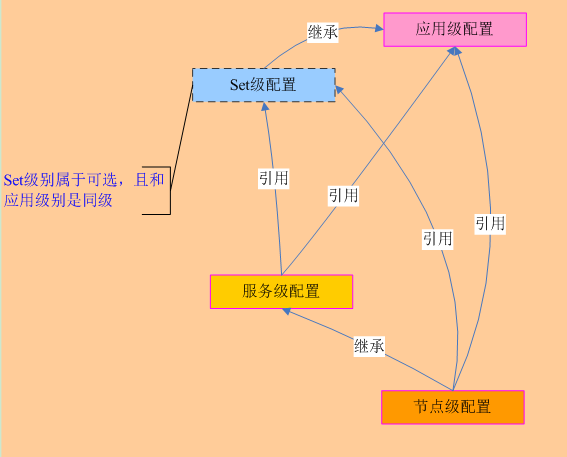
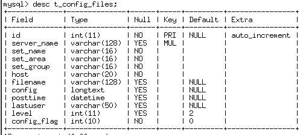
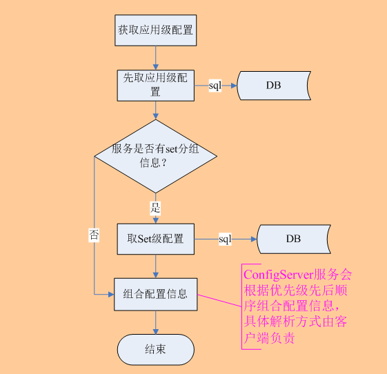
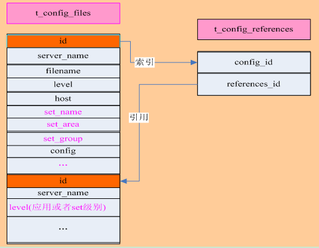
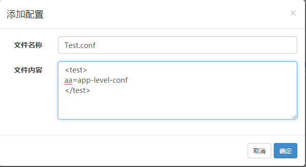
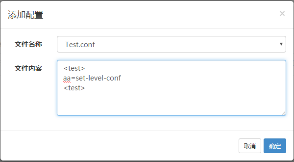

# 目录
> * [业务配置原理](#main-chapter-1)
> * [业务配置示例](#main-chapter-2)

# 1. 业务配置原理 <a id="main-chapter-1"></a>

## 1.1. 配置文件数据结构

基于Tars框架的业务服务的配置文件信息分为三层级别，应用配置、Set应用配置、服务配置和节点配置。

应用级为最高一级的配置文件，在同一应用（业务）下都可以被引用；

Set应用配置继承自应用级配置，即一个Set应用配置必须有相应的应用级配置；

服务和节点配置都可以引用应用配置信息和Set应用配置，并且节点配置默认继承服务配置的内容。

优先级：节点配置 > 服务配置 > Set应用配置 > 应用配置

如下图所示：



Tars框架通过两个数据表来维护这些配置信息，t_config_files和t_config_references。

t_config_files表的主要信息：服务配置文件名称、配置文件类型、配置文件所属服务名，配置文件所属set分组，配置文件所属节点ip以及配置文件的索引id值以及该服务所在set分组信息。

如下图所示：



t_config_references表的主要信息：配置文件的索引id以及该id所引用的配置文件索引id。

如下图所示：


注意：本文所指的引用配置文件都是指应用配置文件或者相应的Set配置文件。

## 1.2. 实现原理

根据上述配置文件内容结构，Tars框架提供了从configServer服务获取应用级配置信息和服务级配置信息（包括同时获取引用配置信息）的接口。

### 1.2.1. 获取应用级配置

目前业务服务获取应用级配置信息的方式是使用框架中提供的addAppConfig接口,该接口负责向configServer服务拉取相应的应用配置文件到本地目录。
```
bool addAppConfig(const string &filename);
```
首先向configServer获取应用级配置信息，同时判断该业务服务是否有set分组信息，如果有则获取相应set分组内的配置信息，最后把配置信息保存到本地文件中。

注意set配置优先级高于应用配置。

主要逻辑如下图：



拉取应用配置的结果图如下：


###1.2.2. 获取服务级配置

目前业务获取服务级别的配置信息方式是使用框架中提供的addConfig接口实现,该接口负责向configServer服务拉取相应的服务配置文件到本地目录。
```
bool addConfig(const string &filename);
```
获取服务级的配置信息主要分为三个步骤：

1.首先以服务名、配置文件名、set分组信息和配置信息等级为检索条件，获取配置信息等级为“服务级别”的配置信息和索引id

2.其次，通过（1）中索引id从数据表t_config_referencses获取该id所引用的配置信息索引id（references_id)，索引id的具体对应关系如下图：



如果存在引用信息，则检索数据表t_config_files中references_id对应的配置信息，同时检索该references_id对应的配置文件是否有“Set级配置信息”，如果有则再获取该set级别配置信息。

3.按顺序合并2和2中获取的配置信息，2为先1其次。

4.再次以服务名、配置文件名、服务所属节点ip和配置信息等级为检索条件，获取配置信息等级为节点级别的配置信息和索引id，然后重复2和3步骤。

5.最终返回给业务服务的服务级配置信息的组成顺序是：服务级的引用配置信息+服务级配置信息+节点级引用配置信息+节点级配置信息。

# 2. 业务配置示例 <a id="main-chapter-2"></a>

## 2.1. 应用配置

在业务树上选择相应的应用（业务），在右边打开的管理界面选择“应用配置”一页，就可以进行添加配置、编辑配置等操作。如下图:


添加应用配置Test.conf,如下图：



## 2.2. Set配置

在业务树上选择相应的Set分组，在右边打开的管理界面选择“Set配置”一页，就可以进行添加配置、编辑配置等操作，如下图:


添加应用配置Test.conf,如下图：



> * 注意：只有添加了相应的应用配置文件，才能添加相应的Set配置。

## 2.3. 服务配置

在左边的业务树选择需要维护的业务服务，点击左边打开的管理界面中“服务配置”一页，就可以进行服务配置的的添加、编辑和删除等操作。如下图：


添加应用配置Test.conf,如下图：


在服务配置里就可以引用上一级的配置内容（即所属应用(业务）的应用配置的内容以及所属Set的配置内容）如下图:


